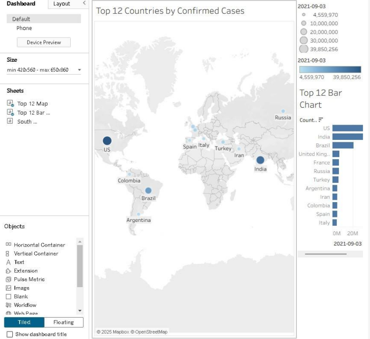
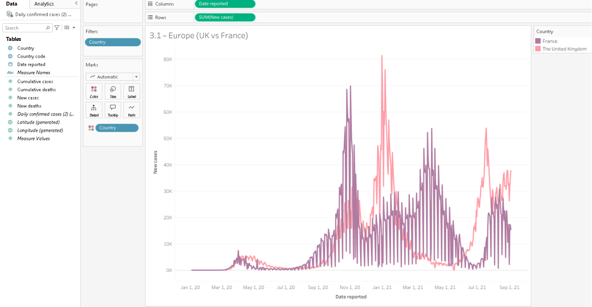
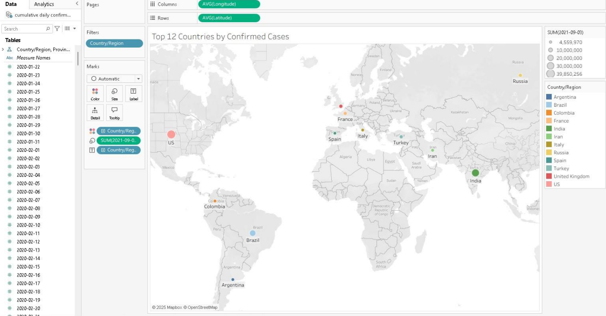

# COVID-19 Global Analytics Dashboard
This Tableau project analyzes global COVID-19 trends through geographic mapping, dashboard design, country-level comparisons, and time-series analysis.

## Tool
- Tableau

## Analytical Techniques
- Geographic Analysis
- Dashboard Design
- Data Visualization
- Descriptive Analysis
- Time-Series Analysis
- Country-Level Comparison

## Business Problem
COVID-19 case data spans countries, dates, and geographic regions, making it difficult to interpret through raw tables alone. This project transforms COVID-19 case data into interactive Tableau visualizations that support geographic comparison, country-level analysis, and time-series trend exploration.

## Project Overview
The project analyzes COVID-19 confirmed cases using geographic mapping, ranked country comparisons, dashboard development, and time-series analysis. Tableau visualizations are used to compare case levels across countries and examine changes in reported cases over time.

## Dashboard Highlights
- Interactive geographic mapping
- Top-country confirmed-case comparison
- Ranked country bar chart
- Time-series trend analysis
- Country-level filtering and comparison

## Key Features
- Built an interactive Tableau dashboard for global COVID-19 analysis
- Created geographic map visualizations showing confirmed cases by country
- Developed a ranked view comparing the top countries by cumulative confirmed cases
- Used proportional map markers to communicate differences in confirmed-case totals
- Built time-series visualizations to compare reported case trends between countries
- Applied country filters to support focused geographic and temporal analysis

## Business Value
The project demonstrates how raw public-health data can be transformed into interactive visualizations that make geographic patterns, country comparisons, and changes over time easier to interpret and communicate.

## Skills Demonstrated
- Tableau
- Dashboard Design
- Data Visualization
- Business Intelligence
- Geographic Analysis
- Time-Series Analysis
- Data Filtering
- Comparative Analysis
- Data Interpretation

## Dashboard Visualizations

### Executive Dashboard

The dashboard combines geographic mapping with a ranked country comparison to highlight countries with the highest cumulative confirmed-case totals.

### Country Time-Series Comparison

This visualization compares reported new COVID-19 cases over time between selected countries, making differences in outbreak timing and case-volume patterns easier to identify.

### Geographic Visualization

The geographic view uses country locations and proportional markers to compare confirmed COVID-19 case totals across selected countries.
